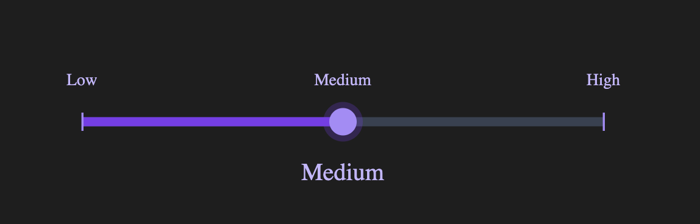
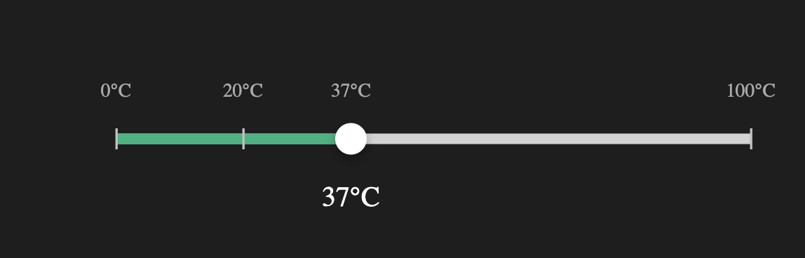
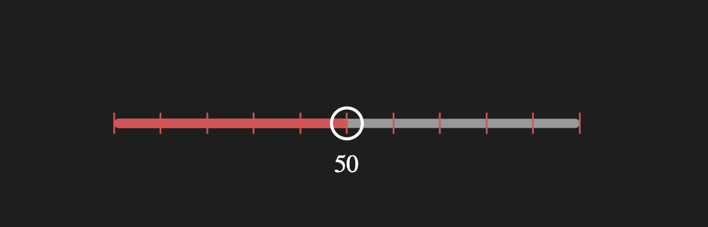

# Tenyour Slider

A controlled, accessible slider built on the native `<input type="range">`
with marks, labels, snapping, and CSS-variable theming.

<p align="center">
  
</p>

## Features

- Accessible: built on native `<input type="range">`
- Controlled API (`value` + `onChange`)
- Marks & labels (step-based, custom positions, or labeled scales)
- Optional snapping to marks
- CSS variable theming via `className` (no need to target internal elements)
- Composable preset classes (`ty-slider-*`)
- Ref forwarding to the underlying input

## Installation

Published on npm: [tenyour-slider](https://www.npmjs.com/package/tenyour-slider)

```bash
npm install tenyour-slider
# or
yarn add tenyour-slider
```

## Basic example

> Important: import `tenyour-slider/styles.css` once in your app (for example in your global styles entry or root layout).

```tsx
import { useState } from "react";
import { Slider } from "tenyour-slider";
import "tenyour-slider/styles.css";

export function Example() {
  const [value, setValue] = useState(50);

  return (
    <Slider
      value={value}
      onChange={setValue}
      min={0}
      max={100}
      marks={10}
      markMode="always"
    />
  );
}
```

> ⚠️ **Note:** Slider is a controlled component.  
> You must update `value` in `onChange` for the thumb to move.

## Custom styling

Styling is done via CSS variables applied through `className`.
For one-off layout overrides (for example width), you can also pass `style` to the slider root.

```css
.mySlider {
  --slider-fill: #6366f1;
  --slider-track-radius: 999px;
  --slider-thumb-size: 20px;
}
```

```tsx
<Slider
  className="mySlider"
  style={{ width: 320 }}
  value={value}
  onChange={setValue}
  min={0}
  max={100}
/>
```

See [Styling](./docs/styling.md) for all variables and [Presets](./docs/presets.md) for built-in classes.

## Preview

<p align="center">
  
</p>

<p align="center">
  
</p>

<p align="center">
  
</p>


## Why Slider?

The native `<input type="range">` is difficult to style consistently and does not support marks or labels.

Slider keeps the accessibility and performance of the native input, while adding:

- marks and labels
- snapping behavior
- a controlled React API
- full theming via CSS variables

## Documentation

- [Getting Started](./docs/getting-started.md)
- [Props](./docs/props.md)
- [Marks & Labels](./docs/marks.md)
- [Styling](./docs/styling.md)
- [Accessibility](./docs/accessibility.md)
- [Presets](./docs/presets.md)
- [Examples](./docs/examples.md)

## Development

Contributions are welcome! Please open an issue to discuss major changes first.

To get started locally:

```bash
git clone https://github.com/tenyour/tenyour-slider.git
cd tenyour-slider
npm install
npm run storybook
```

Storybook runs at [http://localhost:6006](http://localhost:6006). Use it to preview presets, marks/labels behavior, and theming examples.

See [CONTRIBUTING.md](./CONTRIBUTING.md) for more details.

